# Diagrama de Relaciones de Datos - MPDS Streetlifting

## 🔗 Diagrama de Entidades y Relaciones


## 📊 Flujo de Datos por Funcionalidad

### 1. **Registro y Onboarding**

```mermaid
graph TD
    A[Usuario se registra] --> B[Crear User]
    B --> C[Crear UserProfile automáticamente]
    C --> D[Configurar nivel beginner]
    D --> E[Crear DashboardConfiguration]
    E --> F[Redirigir a Setup]
    F --> G[Ingresar 1RM iniciales]
    G --> H[Crear OneRepMax records]
    H --> I[Crear rutina básica]
    I --> J[Dashboard funcional]
```



### 2. **Entrenamiento Diario**

```mermaid
graph TD
    A[Usuario inicia entrenamiento] --> B[Seleccionar rutina]
    B --> C[Crear Workout]
    C --> D[Mostrar ejercicios del día]
    D --> E[Usuario logea series]
    E --> F[Crear Exercise records]
    F --> G[Calcular RPE automático]
    G --> H[Verificar si es nuevo 1RM]
    H --> I[Actualizar OneRepMax si es necesario]
    I --> J[Completar Workout]
    J --> K[Trackear UserInteraction]
    K --> L[Actualizar UserProfile metrics]
```



### 3. **Adaptación del Sistema**

```mermaid
graph TD
    A[Usuario interactúa con la app] --> B[Trackear UserInteraction]
    B --> C[Analizar patrones de comportamiento]
    C --> D[Calcular métricas de adaptación]
    D --> E[Determinar si cambiar nivel]
    E --> F[Actualizar UserProfile]
    F --> G[Ajustar DashboardConfiguration]
    G --> H[Mostrar características apropiadas]
```



## 🎯 Casos de Uso Específicos

### **Dashboard Principal**

```sql
-- Datos necesarios para el dashboard
SELECT
    u.username,
    up.experience_level,
    up.workout_frequency_7d,
    up.data_quality_score,
    orm.exercise,
    orm.one_rm,
    orm.date_achieved,
    w.date as last_workout,
    w.day_type as last_workout_type,
    r.name as active_routine
FROM users u
JOIN user_profiles up ON u.id = up.user_id
LEFT JOIN one_rep_maxes orm ON u.id = orm.user_id
LEFT JOIN workouts w ON u.id = w.user_id
LEFT JOIN routines r ON u.id = r.user_id AND r.is_active = true
WHERE u.id = :user_id
ORDER BY orm.date_achieved DESC, w.date DESC
LIMIT 10;
```

### **Logging de Entrenamiento**

```sql
-- Obtener rutina del día
SELECT
    re.exercise_name,
    re.sets,
    re.reps,
    re.weight_percentage,
    re.rest_time,
    re.is_main_lift,
    orm.one_rm
FROM routine_exercises re
JOIN routines r ON re.routine_id = r.id
LEFT JOIN one_rep_maxes orm ON r.user_id = orm.user_id
    AND orm.exercise = re.exercise_name
WHERE r.user_id = :user_id
    AND r.is_active = true
    AND :current_day = ANY(r.days)
ORDER BY re.order_index;
```

### **Análisis de Progreso**

```sql
-- Progreso de 1RM por ejercicio
SELECT
    exercise,
    one_rm,
    date_achieved,
    LAG(one_rm) OVER (PARTITION BY exercise ORDER BY date_achieved) as previous_rm,
    (one_rm - LAG(one_rm) OVER (PARTITION BY exercise ORDER BY date_achieved)) as improvement
FROM one_rep_maxes
WHERE user_id = :user_id
ORDER BY exercise, date_achieved;
```

## 🔄 Estados y Transiciones

### **Estados de Workout**

```
planned → in_progress → completed
     ↓         ↓          ↓
   success   success    success
     ↓         ↓          ↓
   notes     notes      notes
```

### **Estados de TrainingBlock**

```
planned → in_progress → completed
     ↓         ↓          ↓
   current_week = 1    current_week = total_weeks
     ↓         ↓          ↓
   is_active = true   is_active = false
```

### **Niveles de Experiencia**

```
absolute_beginner → committed_beginner → intermediate → advanced → elite_athlete
       ↓                    ↓                ↓            ↓           ↓
   basic_features      more_features    advanced_features
       ↓                    ↓                ↓
   simple_ui            standard_ui      complex_ui
```

## 📈 Métricas Clave

### **Métricas de Usuario**

- **Frecuencia**: `workout_frequency_7d`, `workout_frequency_30d`
- **Consistencia**: `data_quality_score`
- **Progreso**: Evolución de `one_rm` por ejercicio
- **Experiencia**: `experience_level`, `technical_experience_score`

### **Métricas de Sistema**

- **Engagement**: `session_duration_avg`, `feature_usage_frequency`
- **Adaptación**: `manual_adjustments_count`, `help_requests`
- **Retención**: Patrones de `navigation_patterns`

### **Métricas de Negocio**

- **Usuarios Activos**: Conteo de usuarios con `workouts` en últimos 7/30 días
- **Completación**: Porcentaje de `workouts.completed = true`
- **Progreso**: Promedio de mejora en `one_rm` por usuario

---

_Diagrama actualizado: Diciembre 2024_
_Versión: 1.0_
